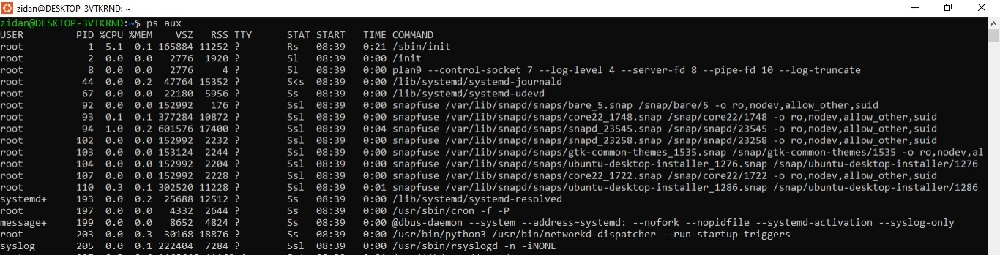
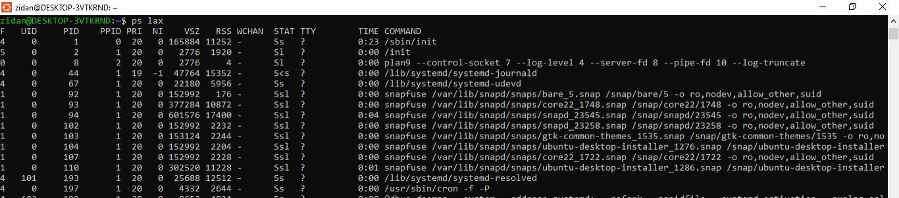
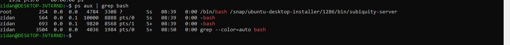
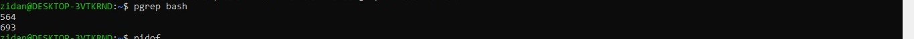
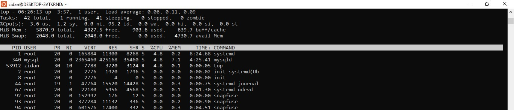
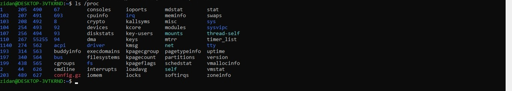

# Component of Process

## Component of process
proses itu terdiri dari (address space) dan truktur data dalam kernal dimana. ruang alamat berisi memroi yang ditandai oleh kernel untuk digunakan oleh proces, ruang alamt bisanya berukuran 4KiB atau 8KiB. struktur data dalam kernel melacak berbagai informasi tentang proses seperti status proses, prioritas, parameter, penjadwalan, dan lainnya.

dapat dikatakan proses meruapakan sebuah wadah yang berisi resource yang dikelola oleh kernel untuk menjalankan program. dimana resource ini mencakup :

- halaman memori yang menyimpan kode dan data program.
- file discreptor yang merujuk ke file terbuka
- berbagai atribut yang menggambarkan suatu process

informasi yang disimpan oleh kernel tentang setiap proses, termasuk :
- peta ruang alamat
- current status
- prosess priority
- informasi penggunaan sumber daya
- informasi file dan port jaringan
- kumpulan sinyal yang diblokir
- pemilik process

Thread adalah konteks eksekusi dalam suatu proses, di mana satu proses dapat memiliki banyak thread yang berbagi alamat memori dan sumber daya lainnya. Thread digunakan untuk meningkatkan paralelisme dalam suatu proses dan dikenal sebagai "proses ringan" karena lebih murah untuk dibuat dan dihancurkan dibandingkan proses biasa. Contohnya, dalam server web, setiap permintaan yang masuk ditangani oleh thread terpisah, memungkinkan server menangani banyak permintaan secara bersamaan.

Setiap proses memiliki Process ID (PID) yang unik, yang digunakan oleh kernel untuk mengidentifikasinya. Proses juga memiliki Parent Process ID (PPID), yaitu PID dari proses yang membuatnya. Selain itu, setiap proses memiliki User ID (UID) yang menunjukkan pemilik proses, serta Effective User ID (EUID) yang menentukan hak aksesnya terhadap sumber daya sistem. Konsep namespace memungkinkan beberapa proses memiliki PID yang sama dalam lingkungan terisolasi, seperti dalam container untuk menjalankan beberapa instance aplikasi secara independen.

## Lifecycle of Process
Untuk membuat proses baru, sebuah proses menyalin dirinya sendiri menggunakan sistem panggilan **fork**. fork menciptakan salinan dari proses asli yang hampir identik dengan induknya tetapi memiliki **PID** yang berbeda dan informasi pencatatan tersendiri. Linux sebenarnya menggunakan **clone**, yang merupakan versi lebih luas dari fork dan menangani thread serta fitur tambahan, tetapi fork tetap digunakan untuk kompatibilitas. Saat sistem dinyalakan, kernel secara otomatis membuat beberapa proses, termasuk **init** atau **systemd** (proses nomor 1), yang menjalankan skrip startup sistem dan menjadi induk dari semua proses lainnya.  

Sinyal (**signals**) adalah mekanisme untuk mengirim notifikasi ke suatu proses, digunakan untuk memberi tahu proses tentang suatu kejadian. Ada sekitar tiga puluh jenis sinyal yang bisa dikirim antar proses sebagai komunikasi, dikirim oleh terminal untuk menghentikan atau menangguhkan proses, dikirim oleh administrator menggunakan **kill**, atau dikirim oleh kernel saat terjadi pelanggaran seperti pembagian dengan nol. Kernel juga menggunakan sinyal untuk memberi tahu proses tentang kondisi tertentu, seperti kematian proses anak atau ketersediaan data pada saluran I/O.

sinyal KILL, INT, TERM, HUP, dan QUIT memiliki tujuan :
- KILL tidak bisa diblokir dan langsung memberhentikan process
- INT mengehentikan operasi yang sedang berjalan dengan perintah (Ctrl + C)
- TERM permintaan untuk menghentikan eksekusi sepenuhnya
- HUP digunakan untuk menunjukkan "hang up" pada koneksi telpon
- QUIT mirip dengan TERM tapi secara defualt menghasilkan core dump jika tidak ditangani

### Prosess KILL signals
ada beberapa langkah dalam menghentikan process dengan menggunakan perintah KILL
```bash
kill [-signal] pid
```
dimana dalam kurung sikut tersebut bisa berisi PID dari process yang ada, bisa juga dengan menggunakan nama process yang ada seperti :
```bash
kill chrome
```
## PS: Process Monitoring
Perintah ps digunakan untuk memantau proses yang sedang berjalan di sistem. Perintah ini menampilkan informasi seperti PID (Process ID), UID (User ID), prioritas, terminal kontrol, penggunaan memori, waktu CPU, dan status proses (running, sleeping, stopped, dll).

Perintah ps dan Kegunaannya
ps aux → Menampilkan semua proses dengan informasi detail:
- a → Menampilkan proses semua pengguna.
- u → Menampilkan detail proses.
- x → Menampilkan proses tanpa terminal terkait.


ps lax → Menampilkan informasi teknis proses dengan lebih cepat karena tidak perlu menerjemahkan nama pengguna dan grup.

- ps aux | grep <nama_proses> → Mencari proses tertentu dengan filter grep.

- pgrep <nama_proses> → Mencari PID dari proses tertentu.

- pidof <path_proses> → Menampilkan PID dari program tertentu.


## Interactive monitoring with TOP
perintah top menampilkan infromasi real-time terkait proses yang berjalan, mencakup informasi CPU, RAM, dan daftar proses aktif. tampilan bisa dikonfigurasi sesuai kebutuhan dan secara default update tampilans etiap 1 - 2 detik.
sementara, htop adalah versi interaktif dari top yang memungkinkan navigasi vertikal dan horizontal, semua proses dapat terlihat lebih detail. tampilan htop lebih ramah pengguna dan banyak fitur tambahan, tapi memerlukan ncurses untuk berjalan

## Nice and Renice : merubah prioritas proses
Niceness merupakan angka yang digunakan untuk memberi petunjuk pada kernel tentang prioritas suatu proses dibandingkan dengan proses lain yang bersain untuk cpu. range nilai niceness -20 sampai +19 dimana lebih tinggi (+19) yang berarti proses tersbut priority nya lebih rendah dan (-20) memiliki priority yang lebih tinggi.
nice digunakan untuk memulai proses dengan niceness tertenu, dan renice digunakan untuk mengubah niceness proces yang sedang berjalan 


## The /proc filesystem
/proc meruapakn pseudo-filesystem yang digunakan oleh kernel untuk mengekspos informasi sistem, termasuk status proses. direktori ini tidak hanya info proses saja, tapi statistik sistem lainnya. 
tiap proses direpresentasikan sebagai direktori dengan nama sesuai PID nya di/proc


## strace and truss
strace adalah alat di Linux yang digunakan untuk melacak system calls dan sinyal yang dijalankan oleh suatu proses. Ini berguna untuk debugging atau memahami apa yang dilakukan program.

## Runaway processes
runaway process adalah proses yang tidak merespon sistem dan meggunakan 100 CPU, menyebabkan sistem menjadi lambat.
perintah untuk mengehntikam sebuah process menggunakan Kill
```bash
kill -9 pid
```
atau
```bash
kill -KILL pid
```

## Periodic Process
### Cron jobs : Scheduled Task
cron merupakan daemon yang menjalankan perintah sesuai jadwal yang telah ditentukan
file konfigurasi:
- linux: /var/spool/cron
- freeBSD: /var/cron/tabs
format Crontab:
```bash
*     *     *     *     *  command
-     -     -     -     -
|     |     |     |     +----- Hari (0-6, Minggu=0)
|     |     |     +------- Bulan (1-12)
|     |     +--------- Tanggal (1-31)
|     +----------- Jam (0-23)
+------------- Menit (0-59)
```
contoh crontab dalam menjalankan Python script setiap tanggal 1 pukul 02.30:
```bash
30 2 1 * * /usr/bin/python3 /path/to/script.py
```
manajemen Crontab:
```bash
crontab -e   # Edit crontab
crontab -l   # List crontab
crontab -r   # Hapus crontab
```
### Systemd Timer
alternatif cron yang lebih fleksibel dan kuat, dengan mengunakan systemctl untuk melihat timer aktif:
```bash
systemctl list-timers
```
sebagai contoh :
```bash
[Timer]
OnCalendar=daily
AccuracySec=1h
Persistent=true
```
Logrotate sebagai contoh penggunaan systemd timer:
```bash
logrotate.timer → logrotate.service (Aktif setiap tengah malam)
```
### Contoh Penggunaan Tugas Terjadwal
- mengirim email otomatis:
```bash
30 4 25 * * /usr/bin/mail -s "Monthly report" mzidan0809@company.com
```
- membersihkan file sampah tiap 30 hari:
```bash
0 0 * * * find /home/user/.local/share/Trash/files -mtime +30 -exec rm -f {} \;
```
- mengelola log agar tidak terlalu besar
- menjalankan batch job
- backup mirroring otomatis menggunakan rsync untuk menyinkronkan data
