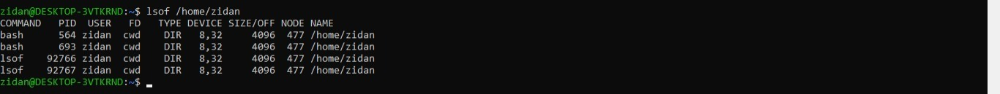

# The Filesystem
filesystem berguna dalam mengatur dan merepresentasikan sumber daya penyimpanan sistem
- Namespace: menyediakan struktur hierarki dalam penamaan dan pengorganisasian
- API: kumpulan sistem panggilan untuk navigasi dan manipulasi objek
- Security models: skema untuk perlindungan, penyembunyian, dan berbagi data
- Impelementation: software yang menghubungkan model logis ke perangkat keras

jenis filesytem populer 
Disk Based filesystem: 
- linux: ext4, XFS, UFS, ZFS, Btrfs
- lainnya: VxFS, JFS
Foreign filesystem:
- windows: FAT, NTFS
- CD/DVD: ISO 9660

## Pathnames
folder merupakan istilah non teknis dari Windows/macOS. dalam teknis gunakan **directory** untuk menghindari kebingungan. **pathname** adalah jalur direktori yang mengarah ke suatu file sistem.
- **absolute path**: jalur lengkap dari root misalnya /home/zidan/file.txt
- **relative path**: jalur relatif terhadap lokasi saat ini misal ./file.txt

## Filesystem mounting dan unmounting
**filesystem** terdiri dari beberapa bagian kecil yang disebut file tree, sedangkan **mounting** digunakan untuk menautkan filesystem ke sistem utama dengan perintah mount. contohnya:
- mount /dev/sda4 /users

**unmounting** dapat dilakukan dengan:
- umount -l (lazy unmount, menunggu hingga tidak digunakan).
- umount -f (force unmount, jika sistem sibuk).

**menelusuri proses menggunakan file system dengan:**
- lsof /home/username → Melihat proses yang mengakses direktori.

- ps up "PID" → Menampilkan detail proses berdasarkan PID.

## Pengorganisasian struktur file
**UNIX** memiliki penamaan dan organisasi yang tidak konsisten, sehingga sulit untuk di upgrade. **Root filesystem** minimal berisi direktori root /, file sstem pening, dan subdirektori utama
**struktur utama**:
- /boot → Menyimpan kernel OS (lokasi bisa bervariasi).
- /etc → Berisi file konfigurasi sistem.
- /bin & /sbin → Menyimpan utilitas penting.
- /tmp → Tempat penyimpanan sementara.
- /dev → Virtual filesystem untuk perangkat.
- /lib & /lib64 → Berisi pustaka sistem, terkadang dipindahkan ke /usr/lib.
- /usr → Menyimpan program standar, manual, dan pustaka tambahan.
- /usr/local → Digunakan di FreeBSD untuk konfigurasi lokal.
- /var → Menyimpan file yang sering berubah, seperti log dan data spool.

baik /usr maupun /var diperlukan agar sistem berjalan dalam mode multiuser

## Tipe file 
filesystem umumnya memiliki tujuh jenis file:
- **regular files**: file biasa berisi teks, data atau program
- **Directories**: menyimpan refrensi ke file lain
- **Character device files**: Berkomunikasi dengan perangkat berbasis karakter (misal, terminal).
- **Block Device files**: Berkomunikasi dengan perangkat berbasis blok (misal, hard disk).
- **Local domain sockets**: Komunikasi antar proses dalam satu host (contoh: Syslog, X Window System).
- **Named pips (FIFOs)**: Mirip socket lokal, tetapi dalam bentuk pipeline komunikasi antar proses.
- **Symbolic links (soft links)**:  Menunjuk ke file/direktori lain, lebih fleksibel daripada hard link.

**note**:
- gunakan **file** untuk melihat jenis file
- **ln** membuat hard link, sedangkan **ln -s** membuat symbolic link
- **/dev** kini dikelola otomatis oleh kernel dan daemon sistem, bukan dibuat manual seperti dulu.

## Atribut file
Setiap file di sistem UNIX/Linux memiliki 9 bit izin (permission bits) yang mengontrol akses baca (r), tulis (w), dan eksekusi (x) untuk tiga kategori pengguna: owner (u), group (g), dan others (o).

selain itu ada 3 bit khusus:
1. Setuid (4000) → Menjalankan file dengan izin pemiliknya.
2. Setgid (2000) → Menjalankan file dengan izin grupnya. Jika di direktori, semua file baru akan mengikuti grup direktori tersebut.
3. Sticky bit (1000) → Mencegah pengguna lain menghapus/mengubah file yang bukan miliknya (berguna untuk /tmp).

perintah prntung untuk mengatur permission:
- ls -l → Melihat atribut file, termasuk izin, pemilik, dan grup.
- chmod → Mengubah izin file (misal, chmod 755 file.txt atau chmod u+w file.txt).
- chown → Mengubah pemilik file (misal, chown abdou:users file.txt).
- chgrp → Mengubah grup file (misal, chgrp users file.txt).
- umask → Menentukan izin default untuk file baru (misal, umask 027 → rwx untuk owner, rx untuk grup, tidak ada izin untuk others).

## Acces control list
masalah yang didapat dengan model izin tradisional UNIX:
- sulit memberikan banyak pemilik untuk satu file
- sulit memberikan izin berbeda untuk grup pengguna yang berbeda pada file yang sama

solusi **Access Control Lists (ACLs)**
ACL memungkinkan file memiliki beberapa pemilik dan izin khusus untuk berbagai grup pengguna.

komponene ACL:
- Access Control Entry (ACE) → Berisi pengguna/grup, izin, dan tipe (allow/deny).
- perintah ACL:
  - getfacl → Melihat ACL file.
  - setfacl → Mengubah ACL file (misal: setfacl -m u:abdou:rw /etc/passwd).
 
Jenis ACL:
**POSIX ACLs** → Model ACL tradisional UNIX
contoh:
```bash
setfacl -m user:abdou:rwx,group:users:rwx,other::r /home/abdou
getfacl --omit-header /home/abdou
```

struktur izin:
```bash
user::rwx
user:abdou:rwx
group::r-x
group:users:r-x
mask::rwx
other::r--
```

NFSv4 ACLs → Model ACL yang lebih canggih, mendukung izin default untuk file dan direktori baru.
