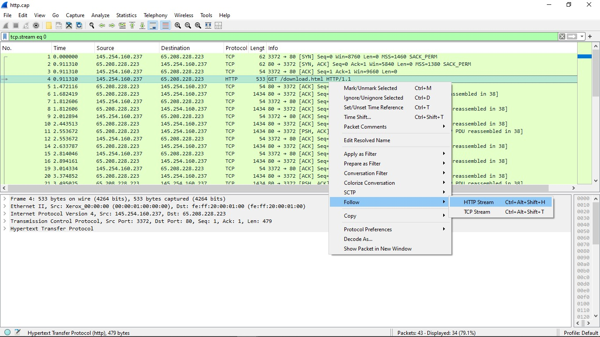
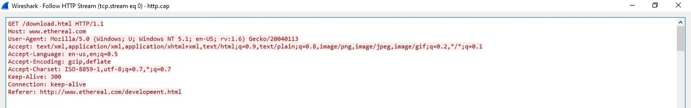
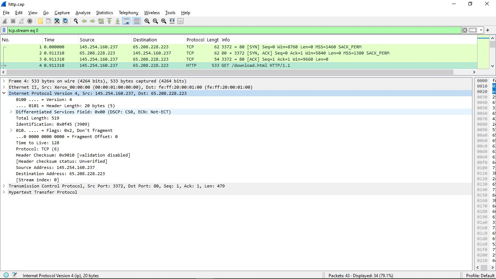
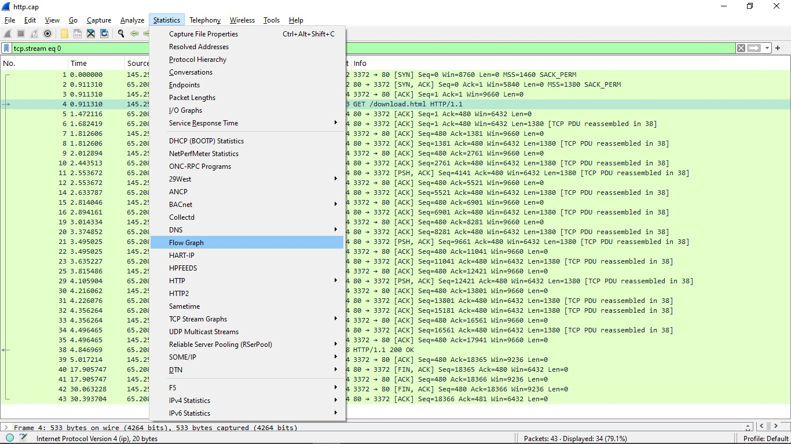
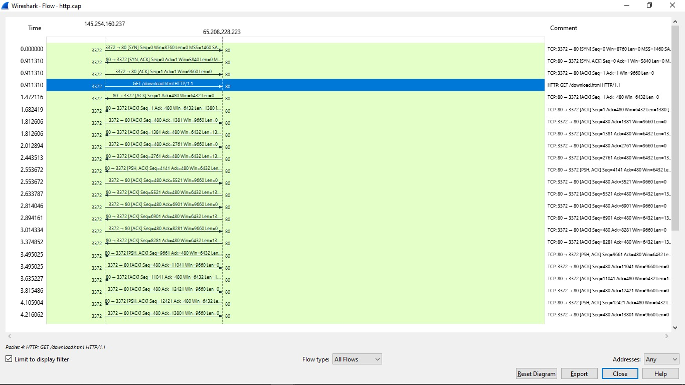
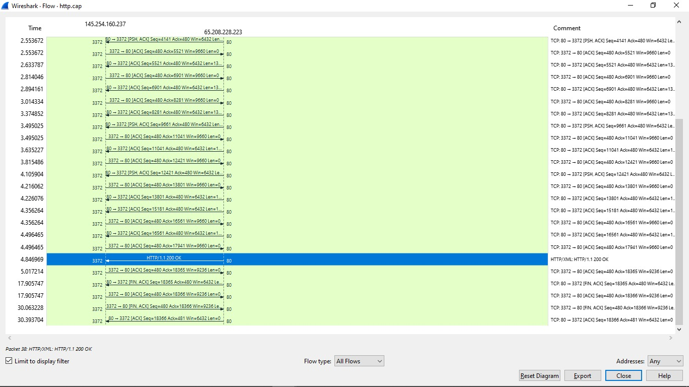
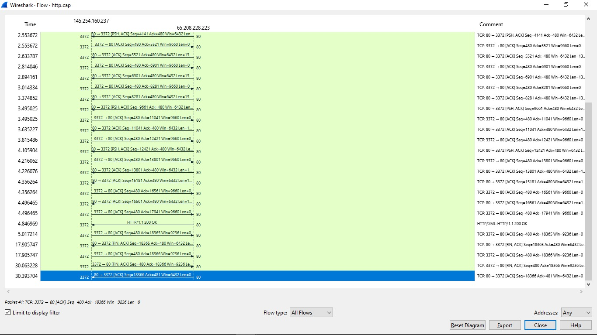
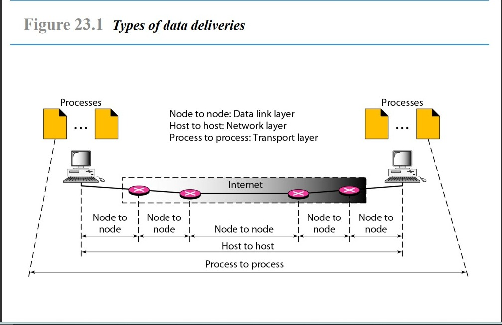

# Laporan Penugasan

## Mata Kuliah: Praktikum Administrasi Jaringan

**Dosen Pengajar:** Dr. Ferry Astika Saputra, ST, M.Sc  
**Dibuat oleh:** Mohammad Zidan Wianto Putra  
**NRP:** 3123600029  
**Kelas:** 2 D4 Teknik Informatika A  

---

## 1. Analisa File `http.cap` dengan Wireshark

### - Versi HTTP yang digunakan
1. Pilih paket yang menggunakan protokol HTTP.

2. Klik kanan dan pilih **Follow HTTP Stream**, maka akan muncul HTTP stream beserta versinya yang berwarna merah.

Hasilnya, versi HTTP yang digunakan adalah **1.1**, yang diperkenalkan pada tahun 1997 dan diperbarui dari RFC 2068 menjadi RFC 2616.

### - IP Address dari Client dan Server

Dari analisis, ditemukan bahwa:
- **IP Client:** 145.254.160.237
- **IP Server:** 65.208.228.223

### - Waktu dari Client Mengirimkan HTTP Request
1. Masuk ke **Statistics** dan pilih **Flow Graph**.

2. Akan muncul semua flow graph dari proses yang ada.

Client mengirimkan HTTP request ke server pada **0.911310 detik**.

### - Waktu Server Menerima HTTP Request dari Client

Server menerima request dari client pada **4.846969 detik**, dengan durasi sebesar **3.935659 detik**.

### - Waktu dari Server Mengirimkan Data dan Durasi

Server mulai mengirimkan data ke client hingga termination pada **30.393704 detik**, dengan durasi sebesar **25.46735 detik**.

---

## 2. Deskripsi Gambar pada Slide 3

### - Analisa Gambar:
- Perangkat di kiri dan kanan adalah **host** (komputer pengguna) yang menjalankan proses aplikasi.
- **Router** (ikon merah di tengah) bertindak sebagai perantara dalam jaringan.
- **Internet** sebagai jalur komunikasi menunjukkan bagaimana data dikirim melalui beberapa node sebelum mencapai tujuan akhir.

### - Layer pada Model OSI:
#### a. **Data Link Layer**
- Menghubungkan perangkat dalam satu jaringan lokal dengan menggunakan **MAC Address** untuk identifikasi.
- Contoh: Komunikasi antar komputer dalam satu kantor yang terhubung ke **switch** atau **router** yang sama.

#### b. **Network Layer**
- Mengatur komunikasi antar perangkat dalam jaringan berbeda menggunakan **IP Address** dan **routing**.
- Contoh: Komputer A (192.168.1.x) mengirim data ke komputer B (10.0.0.x), maka router menentukan jalur terbaik untuk mengirim data.

#### c. **Transport Layer**
- Mengatur komunikasi antar aplikasi di dua perangkat menggunakan **port number** dan protokol seperti **TCP/UDP**.
- Contoh: Saat membuka **WhatsApp Web**, browser mengirim request ke server WhatsApp melalui **port HTTPS 443**.

---

## 3. Rangkuman Tahapan Komunikasi Menggunakan TCP

Komunikasi TCP terdiri dari tiga tahapan utama: **Connection Establishment, Data Transfer,** dan **Connection Termination**.

### a. **Connection Establishment** (Three-Way Handshake)
1. **SYN (Synchronize)** → Client mengirimkan segmen SYN ke server sebagai permintaan untuk memulai koneksi.
2. **SYN-ACK (Synchronize-Acknowledge)** → Server merespons dengan segmen SYN-ACK sebagai tanda permintaan diterima.
3. **ACK (Acknowledge)** → Client mengirimkan segmen ACK sebagai konfirmasi koneksi telah terbentuk.

Setelah ini, koneksi siap digunakan untuk transfer data.

### b. **Data Transfer**
- Setelah koneksi terbentuk, data dikirim antara client dan server.
- **TCP menjamin** data tetap utuh, terurut, dan bebas kesalahan.
- Jika ada paket yang hilang, **TCP akan melakukan retransmission** untuk mengirim ulang paket yang hilang.

### c. **Connection Termination** (Four-Way Handshake)
1. **FIN (Finish)** → Salah satu pihak (client/server) mengirim segmen FIN untuk mengakhiri koneksi.
2. **ACK (Acknowledge)** → Pihak lain merespons dengan ACK untuk mengonfirmasi permintaan tersebut.
3. **FIN** → Pihak kedua mengirimkan segmen FIN untuk menyatakan koneksi siap ditutup.
4. **ACK** → Segmen terakhir sebagai tanda bahwa koneksi benar-benar telah diakhiri.

Setelah ini, koneksi TCP resmi ditutup dan kedua perangkat kembali ke keadaan awal sebelum komunikasi dimulai.

---
