# LAPORAN PENUGASAN

**Mata Kuliah:**  
PRAKTIKUM ADMINISTRASI JARINGAN

**Dosen Pengajar:**  
Dr. Ferry Astika Saputra, ST, M.Sc

**Dibuat oleh:**  
Mohammad Zidan Wianto Putra  
3213600029  
2 D4 Teknik Informatika A  

---

## VM1
### 1. Set Interface untuk Adapter 1 dan Adapter 2

- **Adapter 1:**

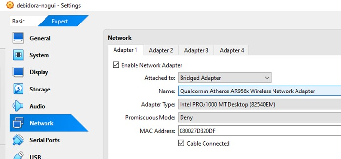

- **Adapter 2:**

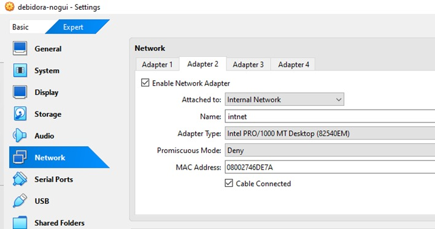

### 2. Cek Interface
Gunakan perintah berikut untuk memeriksa interface:  
```bash
ip a
```
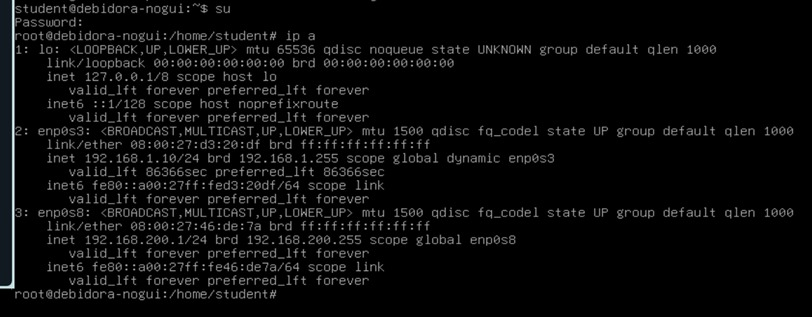

### 3. set ip static
```bash
nano /etc/network/interfaces
```
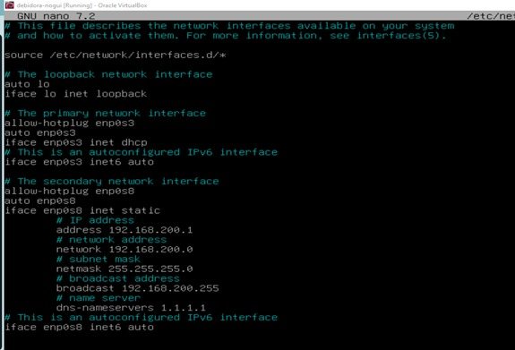

### 4. restart network 
```bash
systemctl restart networking
```

### 5. install iptables 
```bash
sudo apt install iptables
```

### 6. pastikan ip forwarding aktiv di vm1 
- masuk ke dalam file sysctl.conf dengan perintah
```bash
nano /etc/sysctl.conf
```
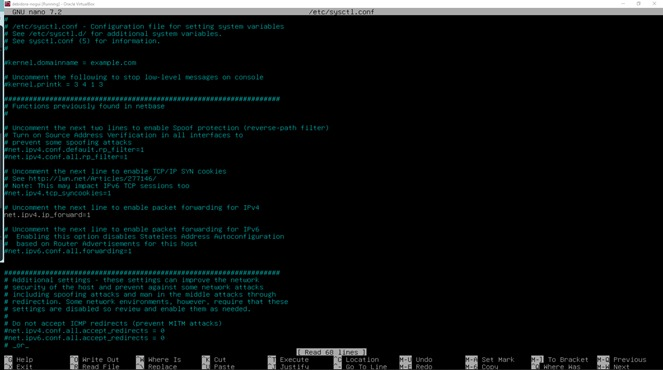

- lalu uncomment untuk line ip-forwarding=1

### 7. atur NAT di vm1 
```bash
iptables -t nat -A POSTROUTING -o enp0s3 -j MASQUERADE
iptables -A FORWARD -i enp0s8 -o enp0s3 -j ACCEPT
iptables -A FORWARD -i enp0s3 -o enp0s8 -m state --state 
```
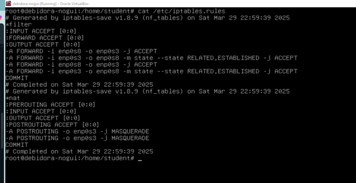

###  8. konfigurasi dns pada vm 1 
- set named.conf & named.conf.option masuk ke file dengan perintah :
```bash
nano /etc/bind/named.conf
```
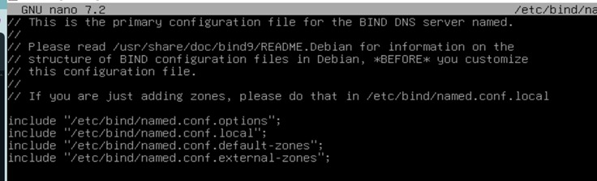
```bash
nano /etc/bind/named.conf.options
```
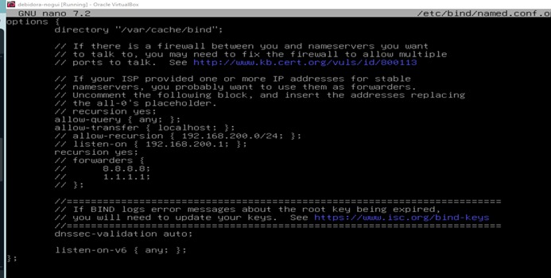

- set named.conf.external-zones dengan menambahkan kelompokX.com :
```bash
nano /etc/bind/named.conf.external-zones
```
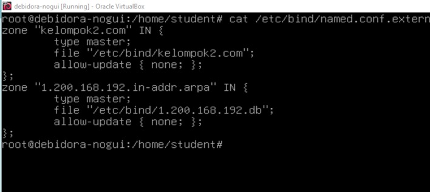

- set kelompokX.com dan Zone ID :
```bash
nano /etc/bind/kelompok2.com
```
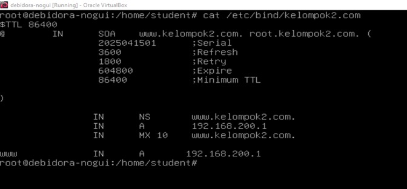
```bash
nano /etc/bind/1.200.168.192.db
```
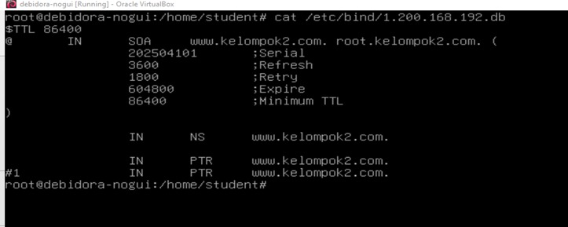

---

## VM2
### 1. set interface adapter 1 dengan internal network
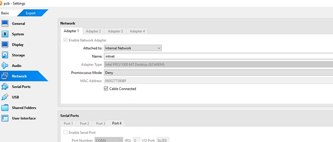

### 2. set ip unutk masuk ke dalam vm1 melalui gateway vm1
- masuk menu setting
- wired
- klick ipv4
- pilih ipv4 dengan manuyal settings
- address :
  - isi address dengan ip dari vm2 yaitu 192.168.200.10
  - netmask : 255.255.255.0
  - gateway : 192.168.200.1
  - DNS : 192.168.200.1, 1.1.1.1
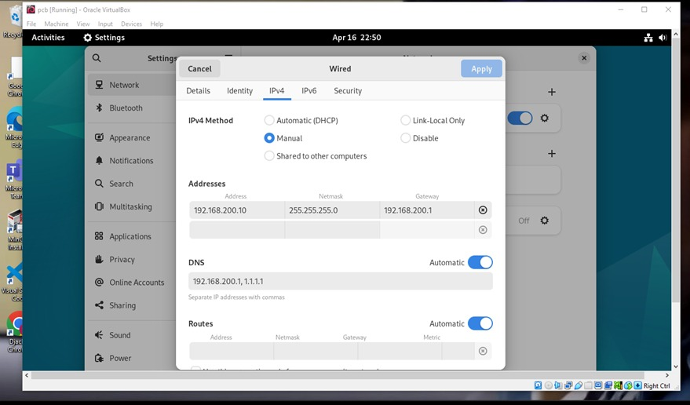
