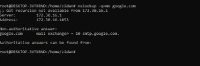
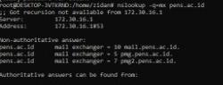
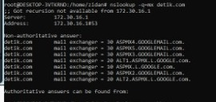

# LAPORAN PRAKTIKUM ADMINISTRASI JARINGAN

**Mata Kuliah:**  
PRAKTIKUM ADMINISTRASI JARINGAN

**Dosen Pengajar:**  
Dr. Ferry Astika Saputra, ST, M.Sc

Dibuat oleh:
Mohammad Zidan Wianto Putra 3123600029  
2 D4 Teknik Informatika A  

## PROTOKOL MAIL
### 1. SMTP 
Simple Mail Transfer Protocol atau lebih dikenal dengan SMTP adalah protokol standar yang digunakan untuk mengirim email dari email client (seperti Outlook atau Gmail) ke server email, atau dari satu server ke server lain. SMTP tidak digunakan untuk menerima email, melainkan hanya untuk mengirimkan email keluar. saat menekan tombol “Send” pada aplikasi email, SMTP bertugas mengantarkan email tersebut menuju server tujuan hingga akhirnya diterima oleh penerima.

SMTP tidak menyimpan email, ia hanya bertugas untuk menyampaikan pesan. Oleh karena itu, protokol ini sering digunakan bersama dengan protokol lain seperti POP3 atau IMAP untuk pengambilan email.

Secara default, protokol SMTP bekerja pada beberapa port berikut:

- Port 25 – port default SMTP yang tidak terenkripsi, namun saat ini sering diblokir oleh ISP karena rawan penyalahgunaan (spam)
- Port 587 – port yang umum digunakan saat ini untuk koneksi SMTP aman dengan STARTTLS
- Port 465 – port yang digunakan untuk SMTP dengan koneksi SSL/TLS langsung (SMTP Secure), meskipun kini dianggap deprecated

### 2. POP3
Post Office Protocol version 3 atau lebih dikenal dengan istilah POP3 adalah sebuah protokol email standar yang digunakan untuk menerima email dari server email ke komputer atau sebuah perangkat. POP3 memungkinkan untuk mendownload pesan-pesan yang ada di server ke perangkat, dan bisa membacanya bahkan saat sedang offline. Namun, setelah email didownload, umumnya email tersebut akan dihapus dari server, sehingga tidak bisa lagi mengaksesnya dari perangkat lain.

POP3 sangat cocok digunakan jika hanya menggunakan satu perangkat untuk mengelola email, dan ingin menyimpan semua pesan secara lokal. Kelebihan lainnya, karena email tersimpan di perangkat kita, ktia tidak perlu khawatir tentang keterbatasan penyimpanan di server email.

Secara default, protokol POP3 bekerja di dua port:

- Port 110 – port non-enskripsi default POP3
- Port 995 – port yang digunakan untuk POP3 dengan koneksi aman (SSL/TLS)

### 3. IMAP
Internet Message Access Protocol atau IMAP merupakan protokol yang dirancang untuk mengakses dan mengelola email langsung dari server. Tidak seperti POP3 yang mendownload email secara lokal, IMAP mempertahankan pesan-pesan di server dan hanya menyinkronkan salinannya ke perangkat pengguna. Dengan pendekatan ini, email dapat diakses secara konsisten dari berbagai perangkat seperti komputer, ponsel, atau tablet, dan setiap perubahan (seperti penghapusan atau pengarsipan) akan tercermin di semua perangkat.

IMAP sering digunakan dalam lingkungan yang membutuhkan akses email dari berbagai lokasi atau perangkat. Protokol ini juga mendukung manajemen folder di server, menjadikannya solusi fleksibel untuk pengguna dengan kebutuhan email yang kompleks.

Secara default, IMAP menggunakan dua port:

- Port 143 – untuk koneksi standar tanpa enkripsi
- Port 993 – untuk koneksi aman menggunakan SSL/TLS (IMAPS)

### 4. POP3S
POP3S merupakan versi terenkripsi dari protokol POP3 yang memanfaatkan SSL/TLS untuk mengamankan transmisi data antara server dan client. Fungsi utamanya tetap sama, yaitu untuk mengambil email dari server dan menyimpannya secara lokal di perangkat pengguna. Namun, dengan adanya enkripsi, komunikasi selama proses pengambilan email menjadi lebih aman dan terlindungi dari potensi penyadapan atau serangan jaringan.

POP3S cocok digunakan dalam skenario di mana koneksi jaringan dianggap tidak sepenuhnya aman, namun tetap menginginkan pendekatan pengelolaan email yang terpusat di perangkat lokal.

Secara default, POP3S beroperasi pada:

- Port 995 – port yang digunakan untuk koneksi POP3 dengan SSL/TLS

## INFORMASI MAIL SERVER DALAM SEBUAH DOMAIN
### 1. google.com

Hasil dari perintah nslookup -q=mx pens.ac.id menunjukkan bahwa domain pens.ac.id memiliki tiga mail exchanger dengan prioritas yang berbeda-beda. Mail server dengan prioritas tertinggi, yaitu pmg.pens.ac.id, memiliki nilai MX preference 5, yang berarti akan digunakan pertama kali saat pengiriman email. Jika server ini tidak merespons, maka email akan dialihkan ke pmg2.pens.ac.id dengan prioritas 7, dan terakhir ke mail.pens.ac.id yang memiliki prioritas 10. Konfigurasi ini menunjukkan bahwa sistem email pada domain pens.ac.id dirancang dengan tingkat redundansi, untuk menjamin email tetap dapat dikirim meskipun salah satu server mengalami gangguan.

### 2. pens.ac.id

Pada domain google.com, hasil query nslookup -q=mx hanya menampilkan satu mail exchanger, yaitu smtp.google.com dengan prioritas 10. Ini menunjukkan bahwa email untuk domain ini akan langsung diarahkan ke server tersebut. Meskipun hanya satu mail exchanger yang tercantum, perlu dipahami bahwa Google memiliki infrastruktur jaringan yang sangat besar dan menggunakan teknologi seperti load balancing dan cluster tersembunyi di balik satu alamat host. Oleh karena itu, walaupun terlihat hanya satu titik tujuan, sistem pengiriman email Google tetap andal dan memiliki toleransi tinggi terhadap gangguan.

### 3. detik.com

domain detik.com memiliki konfigurasi mail exchanger yang lebih kompleks dan lengkap. Berdasarkan hasil perintah nslookup -q=mx detik.com, terdapat tujuh mail exchanger yang seluruhnya menggunakan layanan dari Google, seperti ASPMX.L.GOOGLE.com, ALT1.ASPMX.L.GOOGLE.com, dan beberapa server GOOGLEMAIL.com. Server utama yang digunakan adalah ASPMX.L.GOOGLE.com dengan prioritas 10, diikuti oleh dua server dengan prioritas 20, serta empat server lainnya dengan prioritas 30. Konfigurasi ini menunjukkan bahwa domain detik.com menggunakan layanan email dari Google Workspace dengan pendekatan distribusi beban dan failover yang kuat. Banyaknya cadangan mail server memastikan pengiriman email tetap lancar meskipun sebagian server mengalami gangguan.

## PEMAPARAN TOPOLOGI
