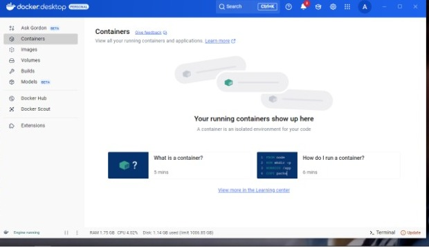
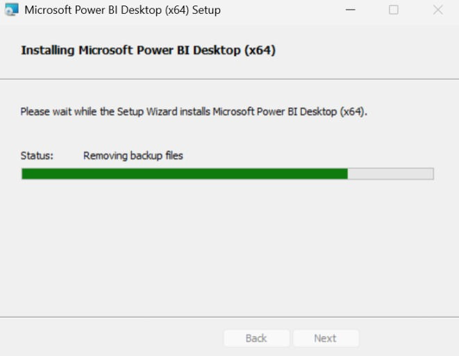
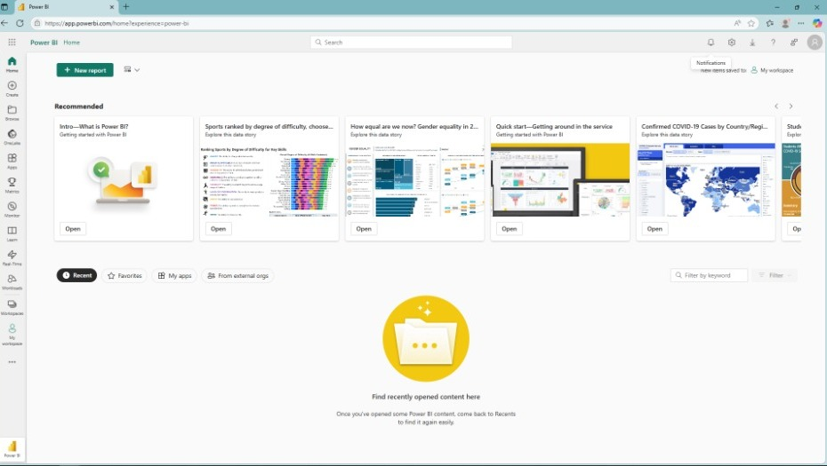
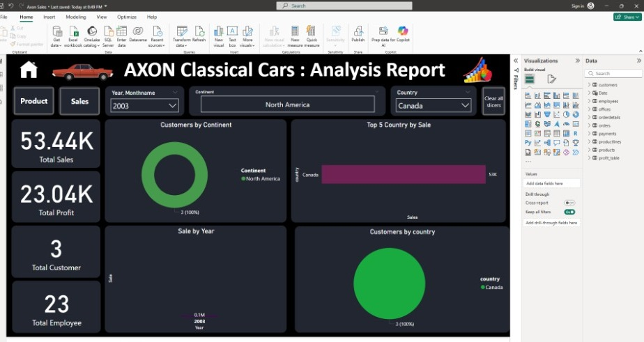
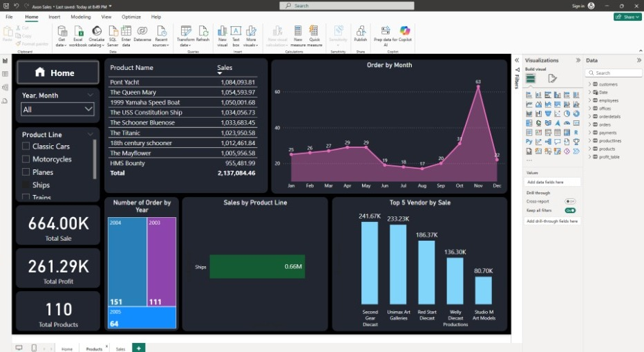
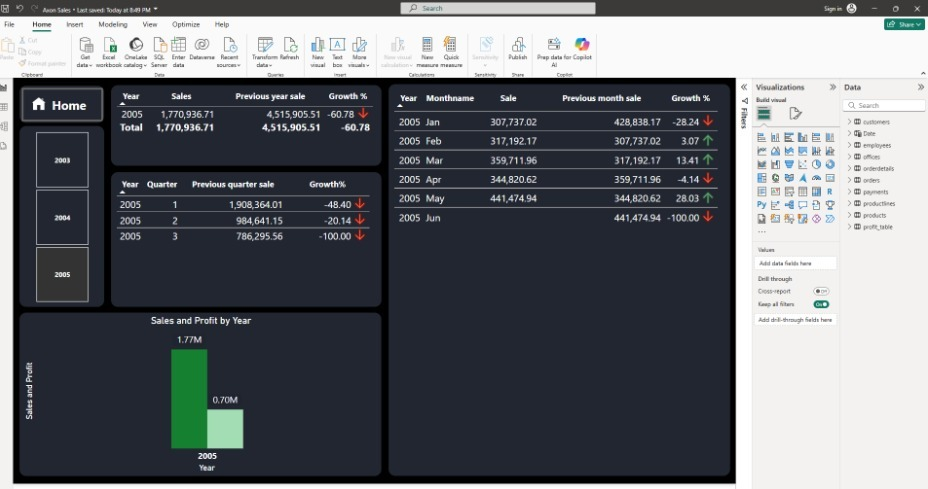

# LAPORAN PENUGASAN

**Mata kuliah:**  
PRAKTIKUM ADMINISTRASI JARINGAN


**Dosen Pengajar:**  
Dr Ferry Astika Saputra ST, M.Sc

**Dibuat oleh:**  
Mohammad Zidan Wianto Putra  
3213600029  
2 D4 Teknik Informatika A

---

## MEMBUAT CONTAINER SEDERHANA

### Instalasi Docker Desktop



Docker digunakan untuk membuat lingkungan yang terisolasi dan konsisten dalam pengembangan dan pengujian database. Dengan Docker, dapat menjalankan container MySQL tanpa perlu menginstall langsung di sistem operasi host.

**Pada percobaan kali ini, yang di-docker-kan:**

- **MySQL Server** – merupakan layanan database yang menyimpan semua data dari sistem informasi AXON.

**Manfaat penggunaan Docker:**

- Menghindari konflik dependensi  
- Memudahkan deployment dan replikasi environment  
- Memudahkan dalam proses kolaborasi tim

---

### Konfigurasi Docker dengan MySQL

```yaml
version: '3.8'

services:
  db:
    image: mysql:8
    container_name: axon-mysql
    environment:
      MYSQL_ROOT_PASSWORD: classicpass
      MYSQL_DATABASE: classicmodels
    ports:
      - "3306:3306"
    volumes:
      - db_data:/var/lib/mysql

volumes:
  db_data:
```

**Analisa:**

Konfigurasi ini digunakan sebagai jembatan penghubung antara Docker dengan environment lain. Mudah dikembangkan, misalnya untuk penambahan phpMyAdmin. Port 3306 dipakai agar Power BI dan tools lain di host bisa terkoneksi ke database. Volume digunakan agar data tetap tersimpan meskipun container dimatikan. Konfigurasi ini juga mempermudah proses setup otomatis.

---

## Instalasi Power BI Desktop





**Power BI** adalah perangkat lunak Business Intelligence dari Microsoft yang digunakan untuk visualisasi data interaktif, analisis mendalam, dan pelaporan berbasis data dari berbagai sumber.

Dengan Power BI, pengguna dapat membuat dashboard, laporan interaktif, dan menggabungkan data dari berbagai sistem secara real-time.

### Data Source:

Data diambil langsung dari container MySQL menggunakan koneksi ODBC ke database `classicmodels`.  
Koneksi dilakukan ke `localhost` port `3306`.

### Proses Integrasi:

1. Menjalankan container MySQL di Docker  
2. Memasukkan data SQL ke dalam database MySQL  
3. Menggunakan MySQL Connector / ODBC agar Power BI dapat terhubung ke container  
4. Menggunakan menu *Get Data* di Power BI dan memilih *MySQL Database*  
5. Meload data ke Power BI dan membuat visualisasi

### Contoh Visualisasi Data:

- Jumlah order per tahun dan bulan  
- Total pembayaran per customer  
- Distribusi produk berdasarkan vendor  
- Filter berdasarkan negara atau status pesanan

---

## Case: AXON

**AXON** adalah perusahaan yang menjual model miniatur mobil klasik ke pasar global. Data yang dikelola meliputi informasi pelanggan, pegawai, pesanan, produk, pembayaran, dan kantor cabang.

### Permasalahan yang Dihadapi:

- Tidak ada sistem manajemen data  
- Sulit memperoleh laporan real-time  
- Keterbatasan akses data untuk tim manajemen

### Tujuan Sistem Informasi:

- Integrasi seluruh data bisnis  
- Penyediaan insight berbasis data untuk mendukung keputusan strategis  
- Optimalisasi operasional penjualan dan manajemen pelanggan

### Struktur Tabel:

- Customers  
- Employees  
- Orders  
- OrderDetails  
- Products  
- ProductLines  
- Offices

---

### Hasil Visualisasi Data di Power BI



