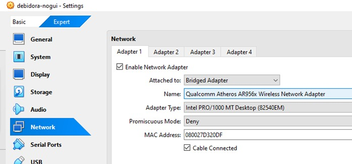
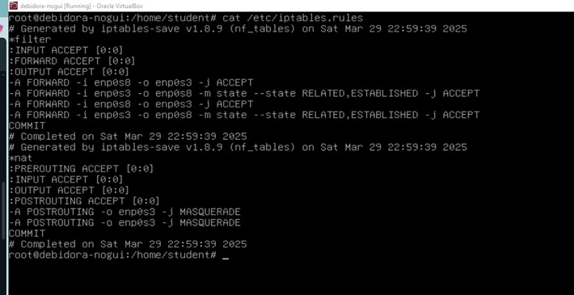
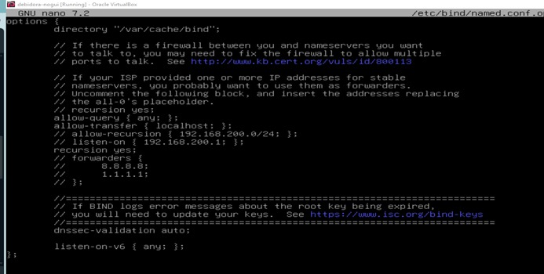
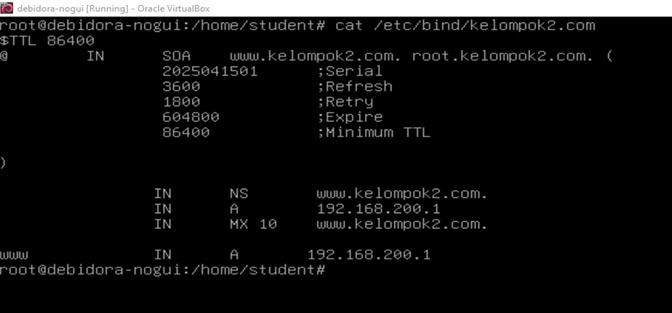
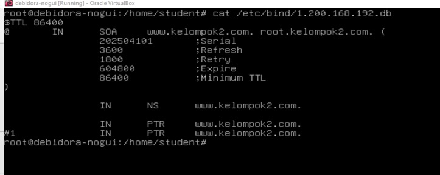
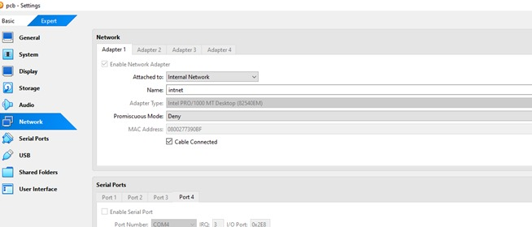
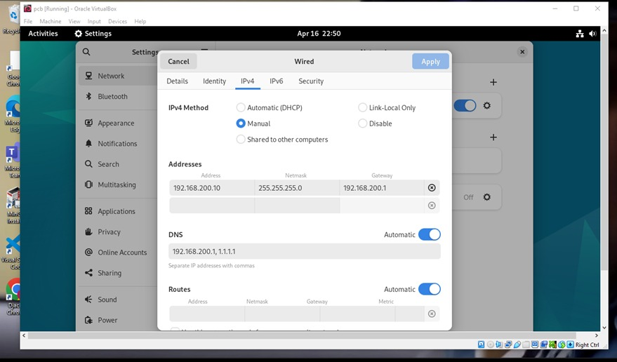

# LAPORAN PRAKTIKUM KELOMPOK 2

**Mata Kuliah:**  
PRAKTIKUM ADMINISTRASI JARINGAN

**Dosen Pengajar:**  
Dr. Ferry Astika Saputra, ST, M.Sc

**Dibuat oleh:**  
M. Alif aditya 3123600016.
George Winston Kalim 3123600022.
Mohammad Zidan Wianto Putra 3213600029.  
2 D4 Teknik Informatika A  

---

---

## Tujuan Praktikum
- Membuat jaringan virtual menggunakan VirtualBox yang terdiri dari 3 VM.
- Mengkonfigurasi VM1 sebagai router (gateway NAT) menggunakan iptables.
- Mengkonfigurasi VM2 sebagai DNS Server menggunakan BIND9.
- Menguji koneksi dan fungsionalitas DNS dari VM3.

---
## Topologi
```
[Internet]
    |
  [VM1] (Router)
  - enp0s3 (Bridge)
  - enp0s8 (Internal: 10.252.108.51)
    |
  [Internal Network]
    |-------------------|
  [VM2] (192.168.2.10)   [VM3] (192.168.2.x)
  - DNS Server            - Client Test
```

---


Pada praktikum ini, kami menggunakan tolopogi jaringan seperti berikut, dimana terdapat beberapa router yang terhubung ke 1 router master, pada gambar di atas, diibaratkan terdapat 2 router saja, dengan IP Address masing-masing `10.252.108.51` dan `10.252.108.52`. Pada masing-masing router, terdapat satu client yang bertugas sebagai DNS server dan Web server dengan IP Address `192.168.x.10`.

Namun, karena pada praktikum kali ini, DNS dan Router sudah dikonfigurasi oleh pengguna lab jaringan sebelumnya, kami mengkonfigurasi untuk web server

## VM1
### 1. Set Interface untuk Adapter 1 dan Adapter 2

- **Adapter 1:**



- **Adapter 2:**


### 2. Cek Interface
Gunakan perintah berikut untuk memeriksa interface:  
```bash
ip a
```


### 3. set ip static
```bash
nano /etc/network/interfaces
```


### 4. restart network 
```bash
systemctl restart networking
```

### 5. install iptables 
```bash
sudo apt install iptables -y
echo 1 | sudo tee /proc/sys/net/ipv4/ip-forward
```

### 6. pastikan ip forwarding aktiv di vm1 
- masuk ke dalam file sysctl.conf dengan perintah
```bash
nano /etc/sysctl.conf
```


- lalu uncomment untuk line ip-forwarding=1

### 7. atur NAT di vm1 
```bash
iptables -t nat -A POSTROUTING -o enp0s3 -j MASQUERADE
iptables -A FORWARD -i enp0s8 -o enp0s3 -j ACCEPT
iptables -A FORWARD -i enp0s3 -o enp0s8 -m state --state 
```


###  8. konfigurasi dns pada vm 1 
- set named.conf & named.conf.option masuk ke file dengan perintah :
```bash
nano /etc/bind/named.conf
```

```bash
nano /etc/bind/named.conf.options
```


- set named.conf.external-zones dengan menambahkan kelompokX.com :
```bash
nano /etc/bind/named.conf.external-zones
```


- set kelompokX.com dan Zone ID :
```bash
nano /etc/bind/kelompok2.com
```

```bash
nano /etc/bind/1.200.168.192.db
```


---

## VM2
### 1. set interface adapter 1 dengan internal network


### 2. set ip unutk masuk ke dalam vm1 melalui gateway vm1
- masuk menu setting
- wired
- klick ipv4
- pilih ipv4 dengan manuyal settings
- address :
  - isi address dengan ip dari vm2 yaitu 192.168.200.10
  - netmask : 255.255.255.0
  - gateway : 192.168.200.1
  - DNS : 192.168.200.1, 1.1.1.1


### **VM3 - Client Uji Coba**
1. **Set Adapter:** Internal Network

2. **Set IP statis:**
   - IP: 192.168.200.3
   - Netmask: 255.255.255.0
   - Gateway: 192.168.200.1
   - DNS: 192.168.200.2

3. **Uji Konektivitas:**
   ```bash
   ping 192.168.200.1
   ping 192.168.200.2
   ping 8.8.8.8
   ```

4. **Uji DNS:**
   ```bash
   dig @192.168.200.2 www.kelompok2.com
   ```

---

## Kesimpulan
Dengan mengikuti instruksi ini, seluruh VM dapat saling terhubung menggunakan internal network. VM1 berhasil berfungsi sebagai router NAT, sementara VM2 berfungsi sebagai DNS server untuk domain internal `kelompok2.com`. Pengujian menggunakan ping dan `dig` menunjukkan bahwa jaringan dan layanan DNS berjalan dengan baik.

---
