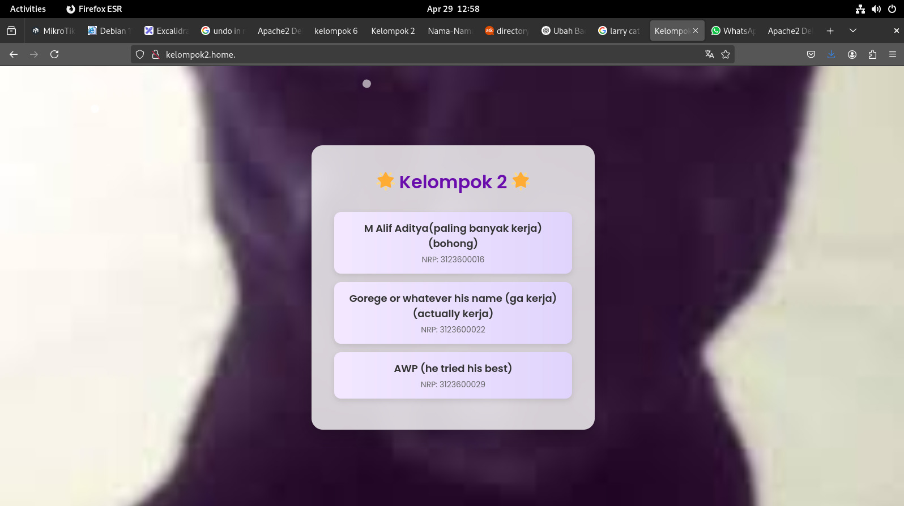

# LAPORAN PRAKTIKUM KELOMPOK 2

**Mata Kuliah:**  
PRAKTIKUM ADMINISTRASI JARINGAN

**Dosen Pengajar:**  
Dr. Ferry Astika Saputra, ST, M.Sc

**Dibuat oleh:**  
M. Alif aditya 3123600016  
George Winston Kalim 3123600022  
Mohammad Zidan Wianto Putra 3213600029  
2 D4 Teknik Informatika A  

---

## Tujuan Praktikum
- Membuat jaringan virtual menggunakan VirtualBox yang terdiri dari 3 komputer.
- Mengkonfigurasi komputer pak ferry sebagai router (gateway NAT) menggunakan iptables.
- Mengkonfigurasi komputer georege sebagai DNS Server menggunakan BIND9.
- Menguji koneksi dan fungsionalitas DNS dari komputer lain yang masih 1 router.

---

## Topologi

```
[Internet]
    |
  [K. P. Ferry] (Router)
  - enp0s3 (Bridge)
  - enp0s8 (Internal: 10.252.108.51)
    |
  [Internal Network]
    |-------------------|
  [georeg] (192.168.2.10)   [Test] (192.168.2.x)
  - DNS Server            - Client Test
```


Pada praktikum ini, kami menggunakan tolopogi jaringan seperti berikut, dimana terdapat beberapa router yang terhubung ke 1 router master, pada gambar di atas, diibaratkan terdapat 2 router saja, dengan IP Address masing-masing `10.252.108.51` dan `10.252.108.52`. Pada masing-masing router, terdapat satu client yang bertugas sebagai DNS server dan Web server dengan IP Address `192.168.x.10`.
Namun, karena pada praktikum kali ini, DNS dan Router sudah dikonfigurasi oleh pengguna lab jaringan sebelumnya, kami mengkonfigurasi untuk web server.

## Instalasi dan Konfigurasi Apache2

Pada tahap ini, kami akan menginstal dan mengkonfigurasi Apache2 sebagai web server pada komputer dengan IP 192.168.2.10 (DNS Server).

### Langkah 1: Instalasi Apache2

```bash
sudo apt update
sudo apt install apache2 -y
```


### Langkah 2: Konfigurasi Apache2

Setelah menginstal Apache2, kami melakukan konfigurasi pada file konfigurasi utama Apache2.

```bash
sudo nano /etc/apache2/apache2.conf
```


Pada file konfigurasi tersebut, kami memastikan bahwa server dikonfigurasi dengan benar untuk melayani permintaan web dari jaringan internal.

## Konfigurasi DNS Server dengan BIND9

### Langkah 1: Instalasi BIND9

```bash
sudo apt update
sudo apt install bind9 bind9utils bind9-doc -y
```


### Langkah 2: Konfigurasi Named

Kami mengkonfigurasi file named.conf untuk mengatur DNS server kami.

```bash
sudo nano /etc/bind/named.conf
```


Kami juga mengkonfigurasi opsi tambahan pada named.conf.options untuk mengoptimalkan DNS server:


### Langkah 3: Konfigurasi Zone Files

Kami membuat dan mengkonfigurasi zone files untuk domain yang akan dikelola oleh DNS server kami:

```bash
sudo nano /etc/bind/named.conf.local
```


### Langkah 4: Membuat Forward Zone File

Kami membuat forward zone file untuk domain yang akan di-hosting:

```bash
sudo nano /etc/bind/db.mydomain.com
```

### Langkah 5: Pengujian Konektivitas dan Fungisionalitas

Kami menguji fungsionalitas DNS server dengan perintah `dig` dan `nslookup`:

```bash
dig @192.168.2.10 mydomain.com
nslookup mydomain.com 192.168.2.10
```


Hasil verifikasi domain dengan perintah `dig`:


## Konfigurasi Akses Domain dan Folder HTML

### Langkah 1: Konfigurasi Virtual Host

Kami mengkonfigurasi virtual host di Apache2 untuk domain yang telah dibuat di DNS server:

```bash
sudo nano /etc/apache2/sites-available/mydomain.com.conf
```

Kemudian kami mengaktifkan virtual host dengan perintah:
```bash
sudo a2ensite mydomain.com.conf
sudo systemctl reload apache2
```

Dari komputer tester, kami mengakses domain yang telah dikonfigurasi melalui browser dengan URL:
```
http://mydomain.com
```



### Langkah 2: Pembuatan Struktur Folder HTML

Kami membuat struktur folder untuk menyimpan file-file website:

```bash
sudo mkdir -p /var/www/mydomain.com/public_html
sudo chown -R www-data:www-data /var/www/mydomain.com
sudo chmod -R 755 /var/www/mydomain.com
```


### Langkah 3: Pembuatan File HTML Sederhana

Kami membuat file HTML sederhana untuk menguji keberhasilan konfigurasi:

```bash
sudo nano /var/www/mydomain.com/public_html/index.html
```


## Kesimpulan

Dalam praktikum ini, kami berhasil mengkonfigurasi jaringan yang terdiri dari 3 komputer dengan fungsi yang berbeda:
1. Komputer dengan IP 10.252.108.25 sebagai router yang menghubungkan jaringan internal ke internet menggunakan NAT
2. Komputer dengan IP 192.168.2.10 sebagai DNS server dan web server yang menghosting domain
3. Komputer lain sebagai tester untuk memverifikasi fungsionalitas dari konfigurasi yang telah dilakukan

Melalui praktikum ini, kami mempelajari:
- Konfigurasi jaringan internal menggunakan VirtualBox
- Konfigurasi router menggunakan iptables untuk NAT
- Instalasi dan konfigurasi DNS server menggunakan BIND9
- Instalasi dan konfigurasi web server menggunakan Apache2
- Pengujian konektivitas dan fungsionalitas menggunakan berbagai tools

Praktikum ini memberikan pengalaman praktis dalam administrasi jaringan dan membantu kami memahami bagaimana komponen-komponen jaringan bekerja sama untuk menyediakan layanan kepada pengguna.
